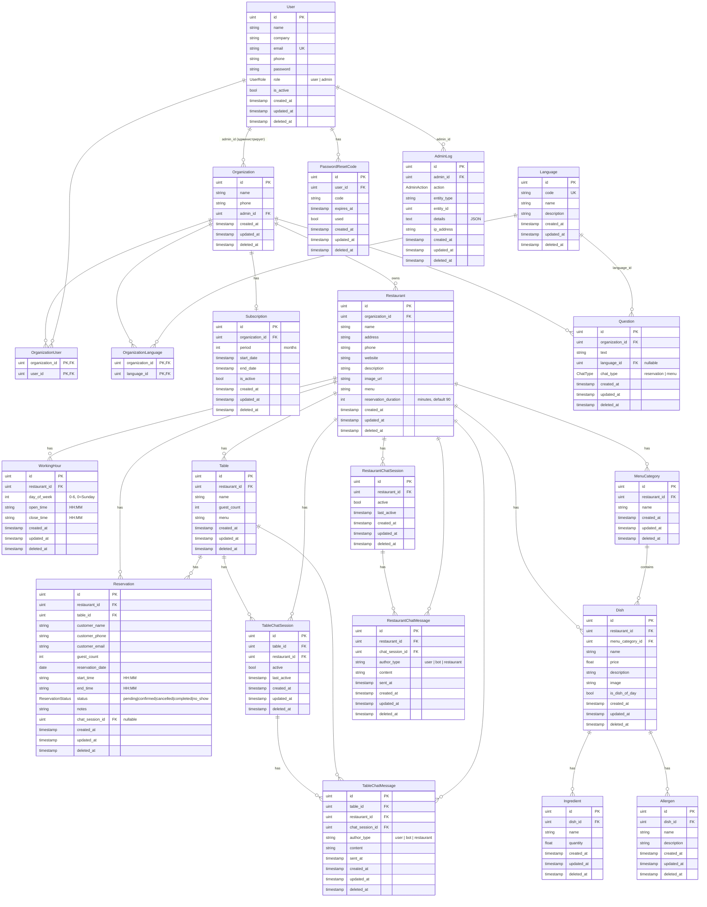
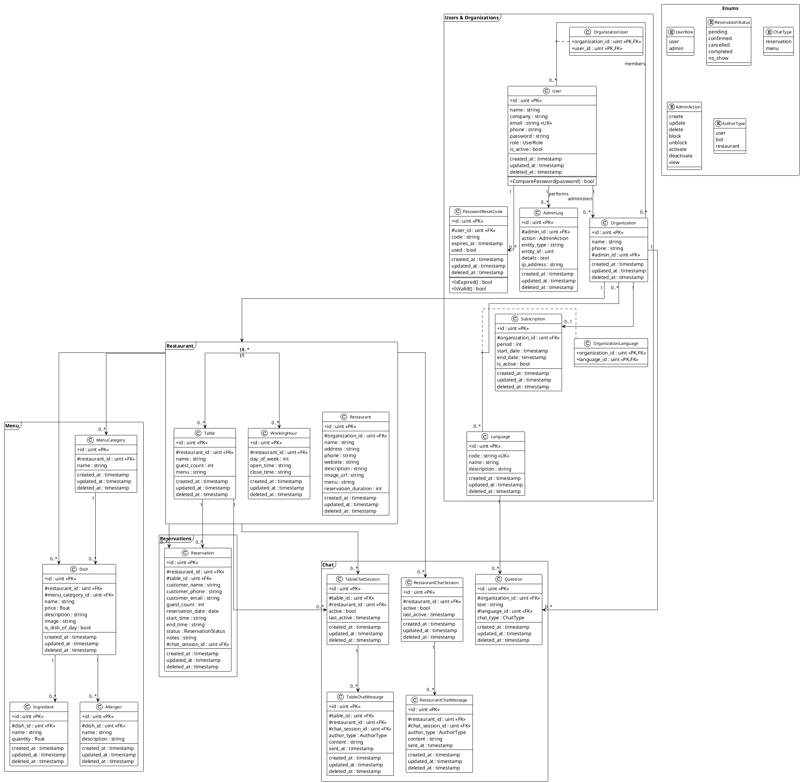

# Схема базы данных Savory AI

## ER-диаграмма



## Таблицы

### Пользователи и организации

| Таблица | Описание |
|---------|----------|
| `users` | Пользователи системы (роли: user, admin) |
| `organizations` | Организации (рестораннные сети) |
| `organization_users` | Many-to-Many связь пользователей и организаций |
| `languages` | Языки (en, ru и др.) |
| `organization_languages` | Many-to-Many связь организаций и языков |
| `subscriptions` | Подписки организаций |
| `password_reset_codes` | Коды сброса пароля |
| `admin_logs` | Логи действий администраторов |

### Рестораны

| Таблица | Описание |
|---------|----------|
| `restaurants` | Рестораны организации |
| `working_hours` | Рабочие часы ресторана по дням недели |
| `tables` | Столы в ресторане |

### Бронирования

| Таблица | Описание |
|---------|----------|
| `reservations` | Бронирования столов |

**Статусы бронирования:**
- `pending` — ожидает подтверждения
- `confirmed` — подтверждено
- `cancelled` — отменено
- `completed` — завершено
- `no_show` — гость не пришёл

### Меню

| Таблица | Описание |
|---------|----------|
| `menu_categories` | Категории меню |
| `dishes` | Блюда |
| `ingredients` | Ингредиенты блюд |
| `allergens` | Аллергены в блюдах |

### Чат

| Таблица | Описание |
|---------|----------|
| `questions` | Быстрые вопросы для чат-бота |
| `table_chat_sessions` | Сессии чата для стола (QR-код) |
| `table_chat_messages` | Сообщения чата стола |
| `restaurant_chat_sessions` | Сессии чата для бронирования |
| `restaurant_chat_messages` | Сообщения чата бронирования |

**Типы авторов сообщений:**
- `user` — пользователь/гость
- `bot` — AI-бот
- `restaurant` — сотрудник ресторана

**Типы чата (для вопросов):**
- `reservation` — чат бронирования
- `menu` — чат меню

## Индексы

Автоматически создаваемые GORM индексы:
- `id` (PK) на всех таблицах
- `users.email` (UNIQUE)
- `languages.code` (UNIQUE)
- `reservations.restaurant_id` (INDEX)
- `reservations.table_id` (INDEX)
- `reservations.reservation_date` (INDEX)

---

## UML Class Diagram (PlantUML)



### Как отрендерить PlantUML

**Онлайн:**
- https://www.plantuml.com/plantuml/uml/
- Скопировать код между `@startuml` и `@enduml`

**VS Code:**
- Установить расширение "PlantUML"
- Нажать `Alt+D` для превью

**CLI:**
```bash
# Установка (macOS)
brew install plantuml

# Генерация PNG
plantuml docs/database_schema.md -o output/

# Генерация SVG
plantuml -tsvg docs/database_schema.md -o output/
```

**IntelliJ IDEA / GoLand:**
- Установить плагин "PlantUML Integration"
- Открыть .puml файл или блок в markdown
